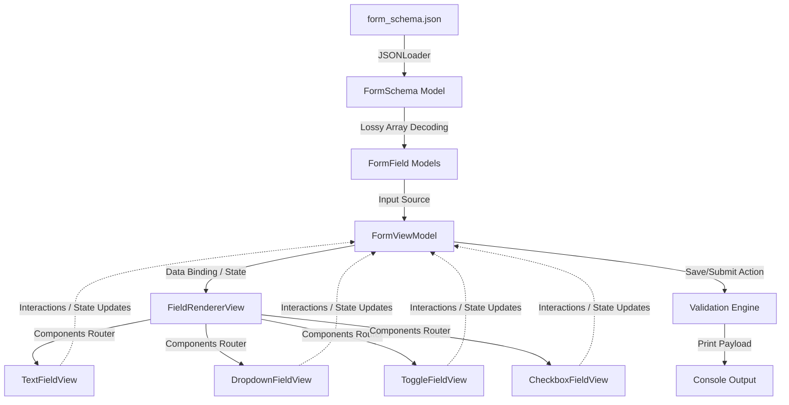

# Dynamic Form Builder (Server-Driven UI)

A production-quality iOS application built with Swift and SwiftUI implementing a **Server-Driven UI (SDUI)** architecture. The application parses a local JSON schema defining form fields, rules, styles, and values dynamically, and renders them in a safe, interactive, and beautifully styled native interface.

---

## 1. Project Overview

The **Dynamic Form Builder** is designed to demonstrate how an iOS client application can be fully driven by external configurations (in this case, local JSON schemas). This decouples the view presentation, styling, and validation rules from hardcoded application releases.

### What the App Does
- Renders an interactive form dynamically from a JSON schema containing diverse component types, keyboard subtypes, default values, character limits, and validation constraints.
- Supports four primary form inputs:
  - **TEXT**: Supports variants like `PLAIN`, `MULTILINE`, `NUMBER`, `URI`, and `SECURE` (passwords) with corresponding native keyboard configurations, placeholders, and active character caps.
  - **DROPDOWN**: Supports both single and multi-selection (via `allow_multiple`) in a tailored sheet interface.
  - **TOGGLE**: Native switch control with inline label styling.
  - **CHECKBOX**: Interactive checkbox style with support for markdown-like inline web links embedded in the label text.
- Supports **Server-Driven Styling** (Theme support) using hex color codes decoded dynamically from the JSON schema, dictating colors for backgrounds, fields, text, borders, primary actions, and errors.
- Handles edge cases defensively, filtering out unknown field types and silently skipping malformed elements without rendering errors or crashing the app.
- Centralizes validation logic, displaying inline errors on validation failure and automatically scrolling to the first invalid field.

### Server-Driven UI (SDUI) Concept
In classic client-server apps, changing a form layout, adding a field, or updating styling requires code changes, a new App Store submission, and waiting for user updates.
With **Server-Driven UI**, the server specifies **what** to render and **how** it should behave via a JSON schema payload. The mobile client acts as an "intelligent player" that interprets the payload and renders high-performance native components accordingly. This approach allows developers to run A/B tests, update compliance forms, or dynamically tweak branding color schemes instantly without releasing a new version of the app.

---

## 2. Architecture

The codebase adheres strictly to clean architectural principles using the **MVVM** pattern, tailored specifically to handle dynamic server-driven UI layouts.



### MVVM Pattern
- **Model**: Codable structures representing the layout components, validation constraints, and styling definitions. Types include `FormField`, `FormSchema`, `DropdownOption`, and `FormTheme`.
- **View**: A declarative rendering hierarchy starting at `DynamicFormView`. The views bind their interaction states directly to the ViewModel.
- **ViewModel**: `FormViewModel` is the single source of truth for the active form state. It stores active input values inside a type-safe `[String: FormValue]` dictionary, publishes loading/error states, generates live SwiftUI bindings dynamically, executes validation checks, and compiles the final form payload on submit.

### Polymorphic Decoding
Because a dynamic form contains fields of differing structures, the client decodes fields polymorphically. 
1. **Discriminator Pattern**: An enum (`FieldType`) acts as the primary discriminator (`TEXT`, `DROPDOWN`, `TOGGLE`, `CHECKBOX`, `unknown`).
2. **Flat Struct Representation**: Instead of complex nested enum containers, a flat `FormField` struct is used. All type-specific properties (e.g. `maxLength` for text, `options` for dropdowns, `defaultValue` for toggles) are modeled as optional properties. This makes the models auto-synthesizable, robust, and highly extensible without requiring custom decoder logic for each new attribute.

### ComponentRenderer (`FieldRendererView`)
The `FieldRendererView` acts as the routing engine for components. It parses the discriminator type of each field model and routes the rendering to the appropriate dedicated SwiftUI component:
- `TextFieldView` for text inputs.
- `DropdownFieldView` for single and multi-select elements.
- `ToggleFieldView` for switches.
- `CheckboxFieldView` for interactive boxes.
- `UnknownFieldView` (fallback placeholder) for unknown types that pass decoding.

It also encapsulates shared component-level responsibilities like rendering the title label, displaying asterisks for required fields, and laying out dynamic inline validation errors (`FieldErrorView`), reducing copy-paste rendering logic in individual component files.

### Dynamic State Management
Because the schema is only known at runtime, we cannot declare static `@State` variables for each input field. Instead:
- State is consolidated into a dictionary: `formValues: [String: FormValue]`.
- `FormValue` is a type-safe enum container wrapping `.string(String)`, `.bool(Bool)`, and `.stringArray([String])`. This enables type-safety, easy SwiftUI diffing (as it implements `Equatable`), and avoids dynamic force-casting.
- **Dynamic Bindings**: The ViewModel exposes binding helpers like `stringBinding(for:maxLength:)` and `boolBinding(for:)` which generate real-time SwiftUI `Binding<T>` structures on the fly. These binders intercept updates, enforce character limits, clear active validation errors, and write back into the state dictionary instantly.

### Validation Flow
1. **Centralized Engine**: When the user taps "Save", the ViewModel's `validate()` method iterates through all visible fields.
2. **Type-Specific Rules**:
   - `TEXT`: Must not be empty or blank whitespace.
   - `DROPDOWN`: Must contain at least one selected option in its array.
   - `CHECKBOX`: Must be checked (`true`).
   - `TOGGLE`: Inherently valid (always carries `true` or `false`).
3. **State Publication**: Any failed rules generate error messages stored inside a `validationErrors: [String: String]` published map, which immediately updates the UI inline.
4. **UX Auto-Scroll**: If any validations fail, `ScrollViewReader` animates the view to scroll the user to the very first field containing an error.
5. **Interactive Correction**: Binders automatically clear errors for a field as soon as the user starts typing or modifying that field, providing a smooth user experience.

---

## 3. Product Decisions

When translating the server requirements to native client code, several product behaviors were underspecified. Below are the key engineering decisions implemented to ensure a robust user experience:

### A. Defensive Handling of Unknown Elements (Lossy Array Decoding)
- **Problem**: In standard Swift `Codable`, if *one* element in an array fails to decode, the *entire* array fails. If a server includes a field of an unknown type (e.g. `"DatePicker"` in the fields list), the entire screen will crash or show an error.
- **Decision**: Implemented a custom **Lossy Array Decoding** initializer in `FormSchema`. Using an unkeyed container, it decodes each `FormField` individually. If decoding fails (due to schema mismatches, malformed types, or unknown attributes), it catches the failure, silently skips the invalid index using a private `AnyDecodable` placeholder to advance the index container, and continues parsing the remaining valid elements. This keeps the application online and displaying all valid elements.

### B. Input-Level Character Cap (Enforced in Binding)
- **Problem**: The JSON schema specifies `max_length: 50` for text fields. Traditional validation only alerts the user *after* they submit a 51-character string, which is frustrating.
- **Decision**: Implemented character capping proactively inside the dynamic `stringBinding(for:maxLength:)` helper. If a user exceeds the `maxLength` constraint, the binder truncates the input string in real-time, preventing the user from typing or pasting any characters beyond the limit.
- **Sentinel Exception**: We also treat values of `maxLength` that are `<= 0` as "unrestricted" rather than enforcing a 0-character limit (which would make the text field unusable).

### C. Dropdown Default Value Filtering
- **Problem**: The server-driven JSON defines default values (e.g., `default_values: ["en", "hi"]`). If a server accidentally publishes a default key that doesn't exist in the options list (e.g., `"fr"` when French is not an option), state corruption or runtime mismatches occur.
- **Decision**: During state initialization (`initializeDefaults`), the ViewModel pre-filters decoded `defaultValues` against the `options` array associated with that field. Only default IDs present in the options list are registered in state, safeguarding client telemetry against legacy or corrupt server payloads.

---

## 4. Challenges & Debugging

### The Toggle Label Responsibility Gap
During development, a rendering issue was encountered: the toggle component switch appeared correctly, but its text label was invisible. 

#### Investigation
The bug was a classic **ownership contract mismatch** between two files:
1. `FieldRendererView` skipped drawing labels for toggles, assuming the toggle component would render its text natively.
2. `ToggleFieldView` rendered the native SwiftUI `Toggle` but used an `EmptyView()` inside its label block, assuming the parent renderer was managing the title text.
This responsibility gap resulted in the label being ignored entirely.

#### Resolution
We resolved this by explicitly defining and documenting the ownership contract. Because standard iOS design conventions place the switch on the right and label on the left, we updated `ToggleFieldView` to natively own and display `field.label` inside the `Toggle` builder closure. We also updated the comments in `FieldRendererView` to ensure future engineers understand this contract.

```swift
// ToggleFieldView.swift
Toggle(isOn: viewModel.boolBinding(for: field.id)) {
    Text(field.label)
        .font(.body)
        .foregroundColor(theme.text)
}
```

### The Unkeyed Container Infinite Loop
During the implementation of lossy array decoding, the custom decoder would freeze the app and hang the thread. 

#### Investigation
When catching a decoding failure inside `FormSchema.init(from:)`, the code skipped adding the element but did not advance the internal index of the nested `nestedUnkeyedContainer`. This caused the loop `while !fieldsContainer.isAtEnd` to evaluate the exact same failing element repeatedly.

#### Resolution
Introduced a throwaway `AnyDecodable` private helper. When a field fails to decode, the decoder attempts to decode `AnyDecodable` from the container. This successfully "consumes" the invalid JSON object regardless of its type, advancing the internal container index safely and preventing infinite loops.

---

## 5. Future Improvements

Given more time, the system could be enhanced in the following ways:

1. **Remote Fetching, Local Caching & Offline Synchronization**
   - Implement an online API client that fetches the newest form schema dynamically from a remote server with `ETag` validation.
   - Cache schemas locally on disk (using standard file systems or CoreData) so the application displays the last loaded form immediately on launch, falling back to local bundle resources only on fresh installs.
2. **JSON-Driven Conditional Visibility & Logic Engine**
   - Introduce a JSON rule engine specifying dependent visibilities (e.g., `"visible_if": { "field": "notifications", "equals": true }`).
   - The ViewModel would parse these rules and dynamically compute the filter logic inside `visibleFields` on every state change.
3. **Comprehensive Component Test Coverage**
   - Build unit test suites injecting mock bundles into `JSONLoader` to verify polymorphic edge cases.
   - Implement Snapshot / UI tests verifying that dynamically generated themes and fields display consistently across different screen sizes.

---

## 6. Running Instructions

### System Requirements
- Xcode 15.0 or later
- iOS 16.0+ Deployment Target
- Swift 5.9+

### Running the App
1. Open the project root folder in macOS.
2. Double-click `DynamicFormBuilder.xcodeproj` to open it in Xcode.
3. Select an iOS Simulator (e.g., **iPhone 15 Pro** or **iPhone 17 Pro**) from the active scheme run target.
4. Press `Cmd + R` or click the **Play** button in Xcode to compile and launch the app.
5. Interactive with the form: filling text fields, checking character caps, tapping dropdown values, and submitting to view print payloads in Xcode's Console debugger window.

---

## 7. AI Collaboration Note

AI-assisted tools were used during the development of this assignment, including ChatGPT and Antigravity.

These tools were used as engineering collaborators for:
- architecture exploration
- SwiftUI implementation guidance
- Codable and polymorphic JSON parsing discussions
- debugging and edge-case analysis
- validation and UI design review

All AI-generated suggestions were reviewed, tested, and adapted before being integrated into the project. Final implementation decisions, debugging, and requirement validation were completed with an emphasis on understanding, correctness, and maintainability.

A record of AI interactions and collaboration history is included in this repository as part of the submission.

## 8.AI collaboration records are included in

- AI_COLLABORATION_LOG.md
- AI_CHAT_EXPORTS/
